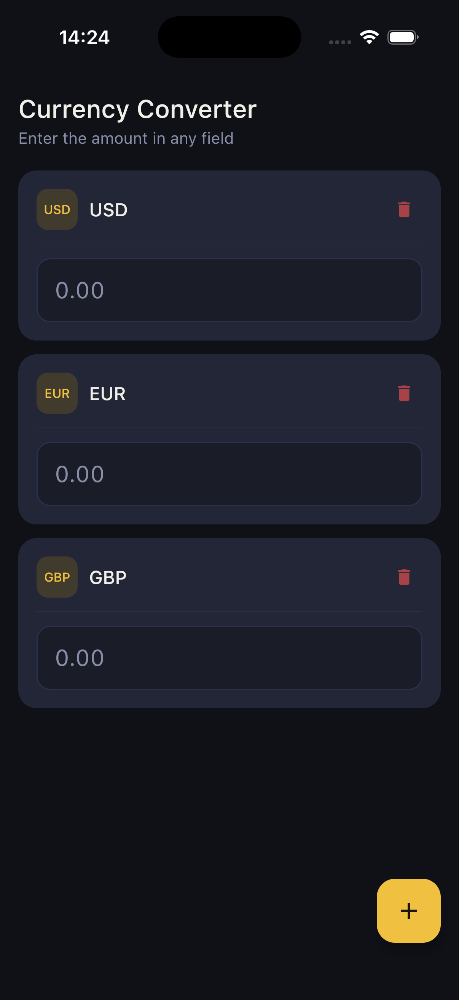
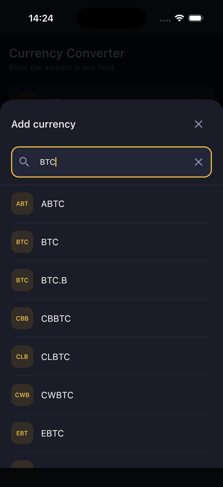

# Currency Converter

A currency converter app built twice — once in Swift (native iOS & macOS) and once in Kotlin + Compose Multiplatform (iOS, Android, Desktop).

The app fetches live exchange rates on launch, lets you save currencies to a watchlist, and converts any amount across all of them simultaneously.

<p>
  
  
</p>

---

## Project Structure

```
Currency-Converter/
├── iosNativeApp/          # Native Swift app for iOS and macOS (SwiftUI, no third-party dependencies)
├── iosApp/                # Compose Multiplatform iOS entry point
├── androidApp/            # Compose Multiplatform Android entry point
├── desktopApp/            # Compose Multiplatform Desktop entry point
├── sharedUI/              # Shared Compose Multiplatform UI and business logic (iOS, Android, Desktop)
├── screenshots/           # App screenshots
├── build.gradle.kts
├── settings.gradle.kts
└── README.md
```

---

## Apps

### Swift — `iosNativeApp/`

Native implementation for **iOS and macOS** using SwiftUI. No third-party dependencies — only system frameworks (UIKit, AppKit, SwiftUI, Foundation).

### Compose Multiplatform — `iosApp/`, `androidApp/`, `desktopApp/`, `sharedUI/`

Cross-platform implementation using Kotlin and Compose Multiplatform. All UI and business logic lives in `sharedUI/` and is shared across all targets.

**Dependencies:** Kotlin Coroutines, Ktor, kotlinx-serialization, Compose Multiplatform.

| Module | Platform |
| --- | --- |
| `iosApp` | iOS |
| `androidApp` | Android |
| `desktopApp` | macOS / Windows / Linux |
| `sharedUI` | Shared UI & logic (all platforms) |

---

## Requirements

**Swift app (`iosNativeApp`)**
- Xcode 15+
- iOS 16+ / macOS 13+

**Compose Multiplatform app**
- Android Studio Hedgehog+
- JDK 17+
- Xcode 15+ (required for iOS target)
- iOS 16+ / Android API 26+